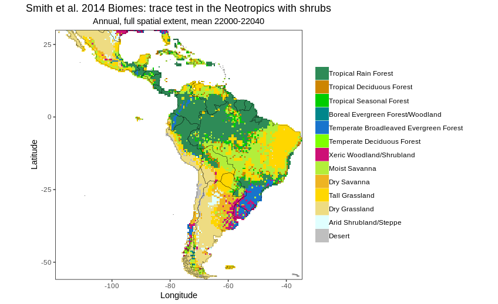
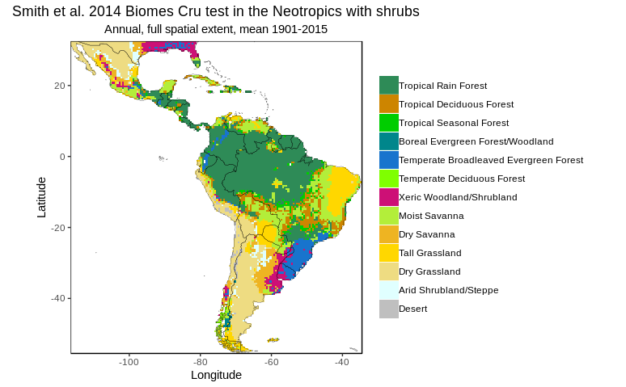

<!--
SPDX-FileCopyrightText: 2021 Wolfgang Traylor <wolfgang.traylor@senckenberg.de>

SPDX-License-Identifier: CC-BY-4.0
-->

# Chronological Lab Notebook

## 2019-12-09
Antoine Champreux sent me a bug report: See [figures/2019-12-05_debugging_by_Antoine.pdf](figures/2019-12-05_debugging_by_Antoine.pdf).

## 2019-11-07
I was struggling to understand the log-algorithm.
But now it makes sense with the quotient and I wrote it in the README.

I found a bug that the `cld` CRU variable was not converted from percentage to fraction.

The `FSDS` output is in reasonable bounds, just a little bit changed to the original.

## 2019-11-06
Download CRU `cld` files:
```bash
cd external_files/cru/
for f in $(find -iname '*pre*');
    do echo $f | sed 's/pre/cld/' | sed 's;^./;https://crudata.uea.ac.uk/cru/data/hrg/cru_ts_4.01/cruts.1709081022.v4.01/cld/;'
done 
```

I am now just using the debiasing log-algorithm from Lorenz et al. (2016) for cloud fraction.
But I don’t know if that makes sense...

## 2019-09-19 Chat with Antoine Champreux
Antoine:
> Hi Wolfgang, I will double check the equivalence between cld and CLDTOT asap, but I was pretty sure of it few months ago. 
> I knew FSDSCL was missing, but it should not be a problem since we can calculate it from FSDS, CLDTOT and FSDSC.
> The division-multiplication method looks good to me as well at first sight.

Wolfgang:
> Yes, we could calculate FSDSCL:
> `FSDS = FSDSC * (CLDTOT-1) + FSDSCL * CLDTOT ⇒ FSDSCL = (FSDS - FSDSC * (CLDTOT-1)) / CLDTOT`

## 2019-09-18 Chat with Antoine Champreux
Wolfgang:
> I have started to look at bias-correcting FSDS. Your formula for re-calculating FSDS from FSDSC,  FSDSCL, and bias-corrected CLDTOT looks okay to me. Did you double-check that the CCSM3 model does actually calculate it like that?
> Since the cloud cover is a fraction, I would bias-correct it with division & multiplication rather than addition:
> `CLDTOT_debiased(t) =  max(1.0, CLDTOT(t) * observed_clouds(modern) / CLDTOT(modern))`
> Now I see a few issues here:
> 1. I don’t find the FSDSCL dataset for download on www.earthsystemgrid.org/project/trace.html
> 2. Is the cld variable in the CRU dataset equivalent to CLDTOT? The latter is the “vertically integrated total cloud fraction”.
> Do you have any thoughts?

## 2019-09-18 Bias-correct TraCE cloud cover
Antoine had written in Slack on June 10, 2019:
> I agree. I will compare the cloud cover in TraCE and CRU-TS, and come back to you. Once this is investigated, and if we need a bias correction, there is maybe another option. In TraCE, I think FSDS is calculated as the sum of weighted means of FSDSC (clear sky) and FSDSCL (cloudy sky) surface downwelling shortwave radiation flux, using CLOUD. This is the case in other climate models. If we make sure of this, we could recalculate FSDS using the debiased CLOUD, and FSDSC+FSDSCL.
> to sum up: FSDS= (1-CLOUD)*FSDSC + CLOUD*FSDSCL.

Antoine had written in Slack on June 25, 2019:
> Being given the relatively constant high cloud cover bias between years notably in south Amazonia and the Cerrado, and considering the sensitivity of LPJ-GUESS to reasonable variations of solar radiations (see above), I think we should debias FSDS via the cloud cover. CLDTOTdebiased(t) = CLDTOT(t) + [  cld(modern) - CLDTOT(modern) ]. Then FSDSdebiased(t) = (1 - CLDTOTdebiased(t))*FSDSC  + CLDTOTdebiased(t)*FSDSCL. Do you agree on this?

My conclusions for today:
- The formula for re-calculating `FSDS` from `FSDSC`,  `FSDSCL`, and bias-corrected CLDTOT looks okay to me. Did Antoine double-check that the CCSM3 model does actually calculate it like that?
- Since the cloud cover is a fraction, I would bias-correct it with division & multiplication rather than addition:
`CLDTOT_debiased(t) =  max(1.0, CLDTOT(t) * observed_clouds(modern) / CLDTOT(modern))`

Now I see a few issues here:
1. I don’t find the `FSDSCL` dataset for download on www.earthsystemgrid.org/project/trace.html
2. Is the `cld` variable in the CRU dataset equivalent to `CLDTOT`? The latter is the “vertically integrated total cloud fraction”. Do you have any thoughts?

## 2019-09-18 Checking ISIMIP3 downscaling/debiasing
I looked at the downscaling & bias-correcting scripts by Stefan Lange: <https://doi.org/10.5194/gmd-12-3055-2019> [@lange2019trendpreserving].
- It requires observed and simulated input in NetCDF format and in the same temporal resolution and with the same variables.
- Our scenario with TraCE is more complex: wet day calculations, many big files for different time periods, and recalculation of `FSDS` (downwelling radiation).
- If we were at the beginning of the project, I might explore it more. But at this stage I don’t think it serves us, since we have almost everything done.

## 2019-06-06 Correcting FSDS in TraCE
- There’s no downwelling radiation in CRU.
- In driver.cpp:928 the solar constant is used to calculate incoming radiation from sunshine/cloud cover. The solar constant is for modern day, not for paleoclimate (Milankovitch cycles!). So using the TraCE variable `CLOUD` will hardly be feasible at all.
- Christian Werner had bias-corrected the TraCE `FSDS` for Chile, but he didn’t use CRU, but Echam.
- I talked with Matt, and we decided for a plan:
    1. Estimate the magnitude of difference in cloud cover between modern-day TraCE (CLOUD variable) and CRU-TS (cld) by comparing plots of the NetCDF files. If there’s not much difference, then we assume that it’s not worth to try bias-correct it.
    2. If the difference is big, we switch from FSDS to CLOUD as input for LPJ-GUESS and bias-correct the cloud cover.
    3. Since LPJ-GUESS derives radiation from fractional cloud cover using formula parameters for today, we will estimate if changing those parameters according to the Milankovitch cycles would make a big difference for the Pleistocene.
    4. If they do indeed make a big difference, we should adjust the formulas in LPJ-GUESS (but that’s probably unlikely).

## 2019-06-05
- On the CRU website I couldn’t find downwelling solar radiation as a variable. (<https://crudata.uea.ac.uk/cru/data/hrg/cru_ts_4.01/cruts.1709081022.v4.01/>)
    + Perhaps it’s not as easy to bias-correct TraCE FSDS then.
    + We could perhaps bias-correct cloud cover and use extra-terrestrial solar radiation?
    + I need to check the Chile data, how they handled FSDS

## 2019-05-09 Output from Antoine Champreux
Antoine gave me these two plots with output from my TraCE bias-corrected data:


I see three possible reasons for the differences between the TraCE and the CRU run:
    1. The CRUNCEP data is not equivalent to the CRU data I used to debias TraCE. (I would have to look up the details on the genealogy of those datasets.)
    2. The solar radiation (FSDS) in TraCE is currently not bias-corrected.
    3. There are slight averaging mismatches: TraCE is bias-corrected with the *means* of CRU data from 1900 to 1960. Also the TraCE wet days are calculated with CRU-JRA daily data. So no *exact* match is to be expected. I don’t know how much difference to expect, though.

## 2019-04-05 Try to fix TraCE simulation
- There is no simulated vegetation even though the temperature and the precipitation are not in reasonable ranges.
- However, the **radiation** (`FSDS`) could be broken.
- I have no feel for realistic radiation numbers, so I will check the CRU files.
- Unfortunately, the [CRU-TS dataset](https://crudata.uea.ac.uk/cru/data/hrg/cru_ts_4.02/) has no radiation variable, but only cloud cover.
- Mateus says that 300 to 400 W/m² might be roughly a realistic value for downwelling radiation. I will check that.

## 2019-04-04 Use `external_files` in the TraCE project
- Create comfortable working environment on the cubs host:
    + I gave SSH access to cubs for all my Schwabe git repos. This is quite a daring security risk!
    + I turned fish and git into a VCSH repo.
    + `conda install neovim` didn’t produce a `nvim` executable. I need to install `conda install -c daizeng1984 nvim`.
    + `conda install -c lebedov fzf` for fuzzy file finding in fish. But the issue is that `fzf_key_bindings` is no function in the conda fish version.
    + There is no `sshfs` (fuse via SSH) package in the conda package list. I only found the python package `fs.sshfs` (<https://github.com/althonos/fs.sshfs>), but I don’t know yet how to use it.
    + `conda install the_silver_searcher`
    + `conda install vim`
    + `vcsh clone git_schwabe:living/vcsh/fish.git`
    + `vcsh clone git_schwabe:living/vcsh/nvim.git`
    + `ln -s ~/.config/nvim ~/.vim ; ln -s ~/.config/nvim/init.vim ~/.vimrc`
    + `vcsh clone git_schwabe:living/vcsh/git.git`
- Created directory: `/akira_data/wtraylor/trace21ka_for_lpjguess/` to store all external files.
- I could start the execution with `make run`, but I didn’t let it finish yet.
- It also works great via SSHFS from my local machine.

## 2019-03-27 Fixing the precipitation in the TraCE script
- I take an original `PRECL` file from TraCE, which is in m/s.
    - I multiply the precipitation with 60*60*24*30 to get (approximately) m/month.
    - Then I multiply with 1000 to get mm/month.
    - That works! I get reasonable precipitation per month.
- I have fixed the formulas in the python script accordingly, but it still doesn’t produce any sensible output.
- However, the precipitation bias file is just completely broken, containing zeros or infinities. I suspect it has something to do with floating point precision.
- I could trace the problem down to some erroneous formulas in the code!
- Still, there is division by zero in the PRECT bias calculation, which leads to INFINITY values in the bias file. This in turn leads to zero wet day cells in the respective months through the whole time series.

## 2019-03-26 Checking the modern-day TraCE-Beringia NetCDF files visually in Panoply
+ The number of wet days seems to be pretty high (often 31).
+ Convert Kelvin to °C: `ncap2 -O -s 'TREFHT-=273.15' TREFHT.nc TREFHT.nc`
+ Many areas have July temperatures of 16 to 21 °C. So that shouldn’t be a problem.
+ Convert precipitation from kg/m²/s to mm/month: `ncap2 -O -s 'PRECT *= 2592000' PRECT.nc PRECT.nc`
    + because: 1 mm/month = 60*60*24*30 mm/s = 2592000 mm/s, and 1 mm is equivalent to 1 l/m² is equivalent to 1 kg/m²
+ There seems to be up to 0.2 mm/month precipitation! This must be the error.
+ The precipitation in the aggregated CRU file `pre_mean.nc` seems to be alright. Here we have values up to 277 mm/month.
+ But converting the values in `heap/rescaled` from kg/m²/s to mm/month yields unreseasonably low values.
+ Already `heap/cropped` has too low values. I think there must be something wrong with the units. I will check my Master’s thesis.
+ I cannot find how I did that in my Master’s thesis. I lost the R file.
+ Okay, I found that the original TraCE file is in m/s. I think something went wrong when converting to kg/m²/s

